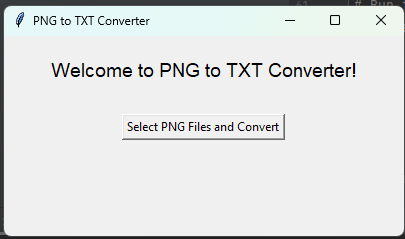

# OCR PNG to Text Converter

This Python script allows you to convert PNG image files to text using Optical Character Recognition (OCR). It uses the Tesseract OCR engine to extract text from the images.

## Prerequisites

Before running the script, make sure you have the following installed:

- Python 3 (https://www.python.org/downloads/)
- Tesseract OCR (https://github.com/tesseract-ocr/tesseract)

Ensure that Tesseract OCR is properly installed and the Tesseract executable file path is correctly set in the script.

You can install the required Python packages by running the following command:

pip install pillow pytesseract tkinter

## Usage

To use the OCR PNG to Text Converter, follow the steps below:

1. Clone or download the repository to your local machine.
2. Install the necessary dependencies by running the command `pip install pillow pytesseract tkinter`.
3. Place your PNG image files in the same directory as the script.
4. Run the script by executing the command `python main.py`.
5. A file dialog will appear, allowing you to select one or more PNG image files.
6. The script will process each image and extract the text using Tesseract OCR.
7. The extracted text will be saved in separate text files with the same name as the input PNG files. The text files will be stored in a folder named "text_files" in the same directory.

## Customization

You can customize the OCR process by modifying the following parameters in the script:

- Language: By default, the script uses the English language for text extraction. If you want to use a different language, update the `lang` parameter in the script accordingly.
- Output Folder: The script saves the extracted text files in a folder named "text_files". If you want to change the output folder, update the `output_directory` variable in the script.

## Limitations

- The accuracy of the OCR process may vary depending on the quality and resolution of the PNG images.
- Ensure that the Tesseract OCR installation and language data files support the languages you want to extract.

## License

This project is licensed under the MIT License. See the [LICENSE](LICENSE) file for more details.
